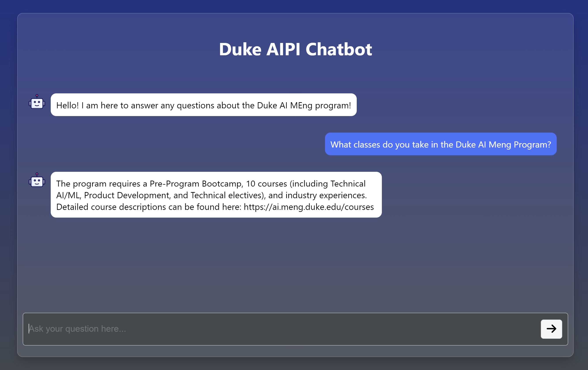

[](https://github.com/NickStrauch13/duke-rag-chatbot/actions/workflows/python.yml)

# Duke AI Master's RAG Chatbot

<p align="center">
    
</p>

This project will be hosted on Azure until 4/21/24. The link to the chatbot is [here](https://duke-aipi-chatbot.azurewebsites.net/).
## Project Description
This chatbot leverages a Mistral 7B large language model (LLM) that has been instruction fine-tuned to specifically address queries and provide detailed information about the Duke AIPI MEng Masters program. Utilizing the technique of Retrieval-Augmented Generation (RAG), the platform dynamically interacts with a comprehensive and curated corpus of the program's documentation. This advanced method allows the system to retrieve the most pertinent and current information from the corpus, augmenting the language model's responses to ensure they are both accurate and contextually relevant.

### How It Works

1. **Query Processing**: Users submit questions or requests related to the Duke AIPI MEng Masters program via the platform interface.
2. **Information Retrieval**: The Retrieval-Augmented Generation system initiates by querying a specialized retriever that searches through a detailed corpus specifically tailored to the Duke AIPI MEng program.
3. **Response Generation**: The retrieved content is then fed into the finetuned Mistral 7B LLM, which synthesizes the information and generates a comprehensive, clear, and contextually enriched response.
4. **Delivery**: The response is presented to the user, providing them with reliable and up-to-date information about the program.

This integration of fine-tuned language modeling with retrieval-augmented generation techniques ensures that users not only receive generalized answers but also responses that are deeply rooted in the specific factual content of the Duke AIPI MEng Masters program.

<p align="center">
    
</p>

## Technical Details

### Large Language Model (LLM) - Mistral 7B
The Mistral 7B model is a type of transformer-based model that has been trained on a diverse range of internet text. For this project, the model has been instruction fine-tuned to handle question-answering and summarization tasks. Therefore, the model doesn't just generate text based on the input but understands and executes a range of instructed tasks, such as answering queries directly, summarizing information, or even comparing different aspects of the program. This makes the platform more intuitive and effective for users seeking specific information. 
Model hosted on [Huggingface](https://huggingface.co/mkeohane01/mistral-instruct-590)

### Retrieval-Augmented Generation (RAG)
Retrieval-Augmented Generation enhances the capabilities the language model by combining it with a retrieval system. In the platform, RAG involves the language model querying a retriever component that searches a pre-built corpus containing detailed information about the Duke AIPI MEng program. The retriever fetches the most relevant documents or snippets of information, which are then fed back into the language model. This combination allows the model to generate responses that are not only contextually aware but also deeply informed by the specific data contained in the program’s corpus.

### Evaluation
The RAG system’s performance metrics are compared to the base Mistral 7B model (pre-finetuning). These metric scores were calculated from the average performance on the questions below using human evaluation.

**Metrics**: (Score rated on a scale of 1-10)
- `Relevance`: How relevant is the response to the input prompt?
- `Accuracy`: How correct is all of the information provided in the response?
- `Informativeness`: How informative or useful is the response?
- `Specificity`: How detailed is the response? 
- `Clarity`: How clear and understandable is the response?

|                | Relevance | Accuracy | Informativeness | Specificity | Clarity     |
|----------------|-----------|----------|-----------------|-------------|-------------|
| Base Model     | 2.182     | 1.307    | 1.926           | 4.816       | 5.881       |
| RAG System     | 9.130     | 8.223    | 7.131           | 6.659       | 7.917       |
| Δ              | 6.948     | 6.916    | 5.205           | 1.843       | 2.036       |


## Getting Started

## To Run

The run the application locally, follow these steps:
1. Clone the repository to your local machine.
2. Create a virtual python environment using `python -m venv venv`.
3. Activate the virtual environment using `source venv/bin/activate` for mac/linux or `venv\Scripts\activate` for windows.
4. Install the project requirements using `pip install -r requirements.txt`.
5. Request the required API keys at njs35@duke.edu and place them in a `.env` file in the root directory.
6. Run the application from the root directory using `python .src/app/app.py`.

## Project Structure

```
├── .devcontainer
├── .github
├── data
├── models
├── app
│   ├── app.py
│   ├── static
│   │   ├── css
│   │   ├── images
├── data
├── notebooks
├── scripts
├── main.py
├── .gitignore
├── .dockerignore
├── Dockerfile
├── Makefile
├── README.md
├── requirements.txt
├── setup.sh
```
